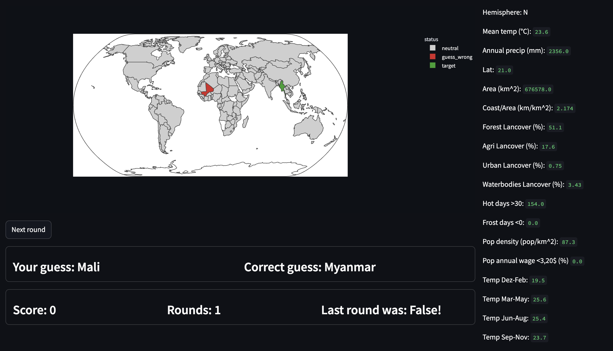

# Geoguessr


## Description
This is a data based version of the public game geoguessr. Players get informational clues about a certain country and then can choose the right country on a map. There are penalties varying by the relevance of the hints. The implementation is being done using Python and Streamlit.

## Sneakpeak


## Installation
**Important:** This game is **python** based and demands the following packages being installed via terminal:

```(bash)
pip install json
pip install pandas
pip install streamlit
pip install plotly
pip install streamlit_plotly_events
```

## Usage
In your terminal navigate to the unzipped (or cloned) folder and run the code using the following commands:

```
cd <your_path>/geoguessr
streamlit run skeleton_app.py
```

## Support
For feedback or issues just hit me up! larspehoviak[at]gmail

## Roadmap
Data Collection --> Data Aggregation --> Streamlit Skeleton --> Beta is running (currently) --> Improvements

## Data Sources
- Climate Change Knowledge Portal
- geoBoundaries
- https://www.cia.gov/library/publications/resources/the-world-factbook/fields/282.html
- https://www.cia.gov/library/publications/the-world-factbook/fields/279rank.html
- https://web.archive.org/web/20120419075053/http://earthtrends.wri.org/text/coastal-marine/variable-61.html
- lancover: Worldbank.org

## Project status
Game is running, but improvements are on the go!
Next up is:
- Integrating a distance based scoring system
- Adding dicciculty levels
- Adding a homescreen for difficulty and number of rounds selection
